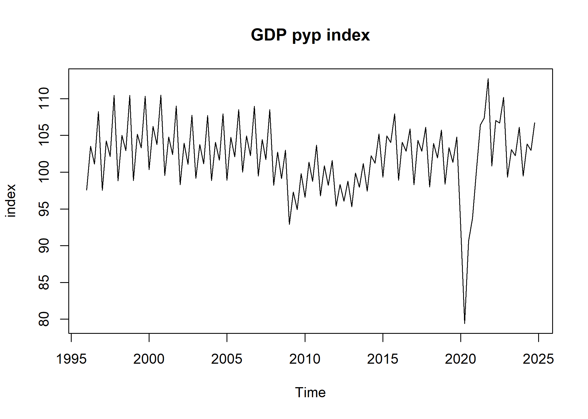
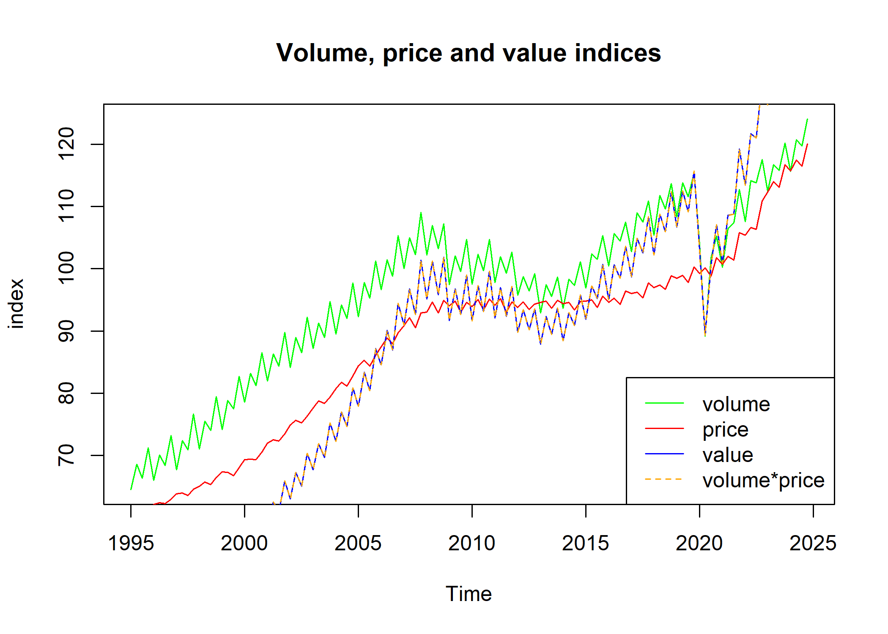

# IndexNumberTools

**IndexNumberTools** intends to ease the everyday work of users and
producers of index numbers by providing functionalities like
chain-linking, base shifting or computing pyp indices.

## Installation

``` r
# Install released version from CRAN
install.packages("IndexNumberTools")
```

## Getting started

We’ll work through an example using the [Spanish
GDP](https://ine.es/dynt3/inebase/en/index.htm?padre=11371&capsel=11371)
in current prices, which is preloaded as `gdp_current`, and the
chain-linked volume (index), `gdp_volume`.

We can easily re-reference the volume series with
`change_ref_year()`.[^1]

``` r
gdp_volume_2010 <- change_ref_year(gdp_volume, 2010)
```

    #> Time Series:
    #> Start = 2008 
    #> End = 2022 
    #> Frequency = 1 
    #>           2020      2010
    #> 2008 104.90885 103.81798
    #> 2009 100.95573  99.90596
    #> 2010 101.05075 100.00000
    #> 2011 100.40412  99.36010
    #> 2012  97.52742  96.51331
    #> 2013  96.13535  95.13571
    #> 2014  97.59707  96.58224
    #> 2015 101.56035 100.50430
    #> 2016 104.52100 103.43417
    #> 2017 107.54800 106.42969
    #> 2018 110.12422 108.97913
    #> 2019 112.28397 111.11642
    #> 2020 100.00000  98.96018
    #> 2021 106.68315 105.57383
    #> 2022 113.27545 112.09758

We can also get the series at previous year prices from `gdp_volume`
with `get_pyp()`.[^2]

``` r
gdp_pyp <- get_pyp(gdp_volume)
```

<!-- -->

Multiplying the volume series by the mean of the current prices series
at the reference year (2020), we obtain the GDP in (chain-linked)
constant prices.

``` r
ref_year_mean <- window(gdp_current,start = c(2020,1), end = c(2020,4)) |> mean()
gdp_constant <- ref_year_mean * gdp_volume / 100
```

By dividing the GDP in current prices by the GDP in constant prices, we
derive the chain-linked implicit deflator of the GDP.

``` r
gdp_deflator <- gdp_current / gdp_constant * 100
```

Using `get_v_index()` and chain-linking the result with
`get_chain_linked()`, we get the chain-linked value indices.

``` r
gdp_value <- get_v_index(gdp_current) |> get_chain_linked(2020)
```

Then, we can verify the identity $V = P\cdot Q$, that is, the value
index must equal the product of the price and volume indices.

``` r
dplyr::near(gdp_value, gdp_deflator * gdp_volume / 100) |> all()
#> [1] TRUE
```

<!-- -->

[^1]: We show only a slice of the output.

[^2]: See the article “Annual arguments” for a detailed discussion.
